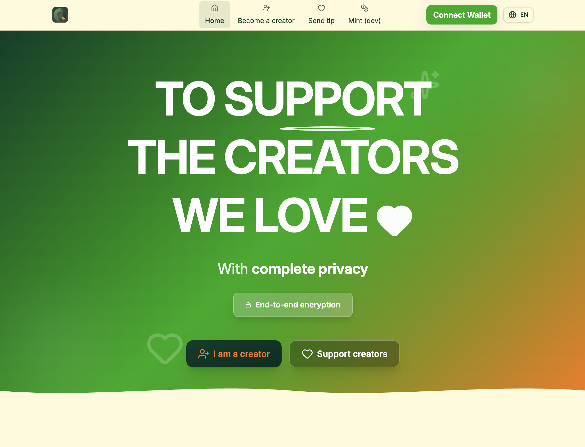

# OnlyFHEn — Confidential Tipping on FHEVM

OnlyFHEn is a privacy‑first tipping platform that lets supporters send confidential tips to creators using an
ERC7984‑compatible confidential token. Amounts remain encrypted on‑chain. Creators decrypt their totals client‑side via
Zama’s Relayer (Ethereum Sepolia) or a local helper (localhost).

## Functionalities

- Supporters tip creators with encrypted amounts; UI auto‑grants token operator when needed
- Creators register, decrypt their confidential balance, and request withdrawals (token payouts)

### Interact With The App

Access a live demo at https://onlyfhens.vercel.app/.

Pages are discoverable via the navbar: Home, Register, Tip, Dashboard; Mint (will only be available in demo mode.)

> Before interacting with the app, make sure that your Metamask (or any other wallet) does not have previous nonce data
> cached.

> If you're a localhost node, import a funded account in your wallet by importing a the hardhat private key.

### For Creators

- Register: Go to the register page, register as a creator by clicking the button, and confirm the transaction in your
  wallet; UI redirects to Dashboard after success. This internally calls `OnlyFHEn.registerCreator()`.
- Decrypt balance:
  - Localhost: the app calls the local FHE helper at `POST /api/user-decrypt`
  - Sepolia: sign an EIP‑712 request in‑browser (Relayer SDK); result decrypts client‑side
- Withdraw: enter an amount; the contract transfers `min(requested, credited)` in confidential tokens - provided that
  you have tips to withdraw.

### For Supporters

- Pick a creator from the list/search.
- Enter amount and send tip
- Operator approval: the UI auto‑grants `OnlyFHEn` as operator on the confidential token with an expiry if required

> Note: You need to own the confidential tokens to tip. You can mint some on the Mint page.

### Token (dev)

- Dev deployments use a mock confidential token by default; anyone can mint it.
- Use the Mint page to call `mint(to, amount)` on the token contract

## Technical Description

### Tech Stack

- Contracts: Solidity + Zama FHEVM types + OpenZeppelin Confidential Contracts
- Tooling: Hardhat, hardhat‑deploy, TypeScript
- Frontend: React Router + Vite + RainbowKit + Ethers
- Local FHE helper: Bun server calling Hardhat FHEVM tasks for encryption/decryption

### Repo Structure

- `contracts/` — `OnlyFHEn.sol` (main), `mocks/MockConfidentialFungibleToken.sol` (dev token used for demo)
- `deploy/01_deploy_onlyfhen.ts` — Deployment script that also writes frontend config with proper environment variables
- `tasks/OnlyFHEn.ts` — Hardhat tasks including JSON helpers used by the local FHE server
- `frontend/` — Web app, dev server, and local FHE helper (`server/local-fhe.ts`)

### Supabase Integration

The frontend integrates Supabase to store the mapping of creator profiles to wallet addresses. It defaults to
localStorage if Supabase env vars are not set (e.g. for localstorage) or if the network is localhost.

- Configuration (frontend): set `VITE_PUBLIC_SUPABASE_URL` and `VITE_PUBLIC_SUPABASE_ANON_KEY` in `frontend/.env.local`.
- Schema and RLS: see `docs/SUPABASE.md` for the SQL to create the `creators` table and enable Row Level Security.
- Security warning: the SQL includes optional anonymous write policies for quick demos. For production, do not allow
  anonymous writes. Instead, enforce authenticated writes where the caller proves wallet ownership (e.g., serverless
  function verifies a signed message and writes with a service role), or issue short‑lived JWTs with an `address` claim
  and RLS policies that restrict inserts/updates to `lower(address) = lower(auth.jwt() ->> 'address')`.

If you skip the authenticated flow for now, keep anonymous write policies only for development/testing environments.

## Run locally

### Prerequisites

- Node.js 20+
- npm 7+
- A wallet (e.g., MetaMask)
- Bun (for the local FHE helper / frontend part): https://bun.sh
- Sepolia: funded account + RPC URL (if deploying to Sepolia)
- Optional: Supabase project (to retain creator profiles)

### Install

- Root deps: `npm install`
- Frontend deps: `cd frontend && npm install` (or `bun install`)

### Environment Setup (Hardhat Vars)

Use Hardhat Vars to store your own secrets locally (encrypted). Do not use plaintext `.env` files.

- Sepolia (required to deploy):
  - Private key: `npx hardhat vars set SEPOLIA_PRIVATE_KEY 0x...`
  - RPC URL: `npx hardhat vars set SEPOLIA_RPC_URL https://sepolia.infura.io/v3/<KEY>` (or any Sepolia RPC)
  - Optional Etherscan key: `npx hardhat vars set ETHERSCAN_API_KEY <key>`
  - Optional existing token: `npx hardhat vars set TOKEN 0x...` (skips deploying the mock token) - you can reuse the one
    at `0x435e08d7754a15015e9ad057f5A0E59BEE49A98c` if required.

### Deploy

The deploy script deploys the confidential token (unless `TOKEN` is set) and `OnlyFHEn`. It also writes frontend config:

- `frontend/.env.local` with `VITE_ONLYFHEN_ADDRESS_<NETWORK>` and `VITE_TOKEN_ADDRESS_<NETWORK>`

#### Local Hardhat

- Start node: `npm run chain` (chainId 31337)
- In another terminal, deploy: `npm run deploy:localhost`
- This will save the addresses to `frontend/.env.local` and `frontend/app/config/contracts.localhost.json`

#### Sepolia

- Ensure vars are set: `SEPOLIA_PRIVATE_KEY`, `SEPOLIA_RPC_URL` (and optionally `TOKEN`)
- Deploy: `npm run deploy:sepolia`
- Optional verify: `npm run verify:sepolia -- <OnlyFHEn_address> <token_address>`

### Run the App

The frontend auto‑detects network from your wallet. Addresses are read from `frontend/.env.local`, adapting to the
network set up.

#### Localhost (frontend + FHE helper)

- Terminal A (local FHE helper): `cd frontend && npm run local-fhe` (required bun installed)
  - Exposes HTTP on `http://127.0.0.1:8787` (override with `VITE_LOCAL_FHE_URL`)
  - Internally shells to Hardhat tasks for encrypt/decrypt JSON
- Terminal B (frontend): `cd frontend && npm run dev`
- Connect your wallet to the Hardhat network (31337). RainbowKit is preconfigured for `http://127.0.0.1:8545`.

#### Sepolia (frontend only)

- `cd frontend && npm run dev`
- Connect wallet on Sepolia (chainId 11155111)
- The app loads Zama’s Relayer SDK in the browser for encryption/decryption

### Quick Flows

- Localhost
  - Start Hardhat node → Deploy → Start local FHE helper → Start frontend
  - Mint tokens (dev) → Register as creator → Tip a creator → Creator decrypts balance → Withdraw
- Sepolia
  - Deploy (or set `TOKEN`) → Start frontend → Connect wallet on Sepolia
  - Register as creator → Tip a creator (auto‑operator grant) → Creator signs EIP‑712 to decrypt → Withdraw

## Troubleshooting

- Wrong network: switch wallet to Hardhat (31337) or Sepolia (11155111)
- Local FHE helper down: start `npm run local-fhe` in `frontend/`; the UI shows status
- Sepolia RPC: ensure `SEPOLIA_RPC_URL` is set via Hardhat Vars
- Ethers not loaded: the frontend loads Ethers v6 via CDN; hard refresh if needed

## License

BSD‑3‑Clause‑Clear. See `LICENSE`.
