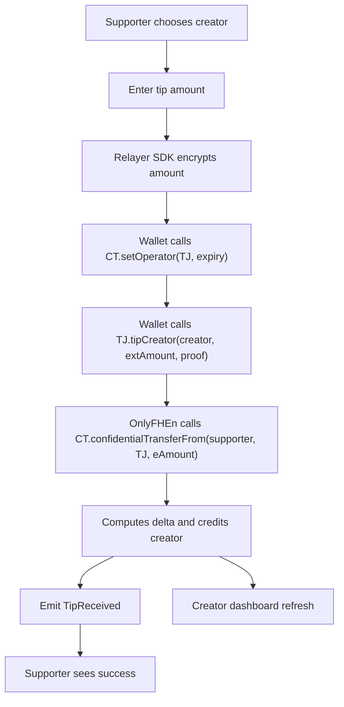

# OnlyFHEn – Product Requirements Document

## 1. Product Overview

OnlyFHEn is a privacy-first tipping platform built on Zama’s Fully Homomorphic Encryption Virtual Machine (FHEVM).
Supporters send tips using a confidential fungible token (ERC7984), ensuring that amounts remain private on-chain.
Creators can decrypt and view their totals through controlled, auditable flows using Zama’s Relayer. The product
demonstrates how Zama FHEVM and OpenZeppelin Confidential Contracts combine to deliver practical confidentiality.

## 2. Goals & Non-Goals

- Goals
  - Ship a reference dApp leveraging Zama FHE technology for privacy-enabled payments, using confidential tokens.
  - Demonstrate top-notch UI/UX integration of Zama in an Ethereum dApp.
  - Make the application accessible to non-technical users. It must be usable by anyone familiar with Ethereum and
    wallets.
  - Provide intuitive dashboards for creators and a simple tipping flow for supporters, keeping amounts fully private.
    launch.

## 3. Primary Personas

- Creator – Streamer, artist, educator – any kind of content creator who accepts private tips.
- Supporter – Fan who sends a confidential tip while expressing appreciation.

## 4. Value Proposition

Creators retain financial privacy while supporters enjoy a frictionless tipping experience on Ethereum. The dApp serves
as a canonical example for teams building privacy-enabled payments with FHEVM and confidential tokens.

## 5. Payment Token

- The product relies on OpenZeppelin Confidential Contracts. The payment asset is a confidential fungible token
  compatible with ERC7984 (aka “confidential token”).
- For demo purposes, a deployed token address is provided at OnlyFHEn deployment or initialization.
- For demo purposes, the token can be minted by anyone.

```mermaid
flowchart TD
    subgraph Client
        UI[React dApp]
        Wallet[Wallet + Signer]
        RelayerSDK[Zama Relayer SDK]
    end
    subgraph Onchain
        TJ["OnlyFHEn (FHE)"]
        CT["Confidential Token (ERC7984-compatible)"]
        ACL[FHE ACL / Permissions]
    end

    %% Client-side encryption and signing
    UI --> RelayerSDK
    RelayerSDK --> Wallet

    %% Operator grant for token pulls (MVP)
    Wallet -->|setOperator(TJ, expiry)| CT

    %% Tipping flow
    Wallet -->|tipCreator(extAmount, proof)| TJ
    TJ -->|confidentialTransferFrom(supporter, TJ, eAmount)| CT

    %% Withdrawal flow
    Wallet -->|requestWithdraw(extAmount, proof)| TJ
    TJ -->|confidentialTransfer(creator, eAmount)| CT

    %% FHE permissions
    TJ --- ACL
    TJ --- CT
```

## 11. Flow Diagram – Supporter Tipping (MVP Operator Flow)



## 12. Milestones & Deliverables

1. Contract & Tests – OnlyFHEn with ERC7984 integration; Hardhat tests; deployment scripts.
2. Frontend MVP – Wallet connect, register, supporter tipping, creator withdrawal, balance review; network indicator and
   basic UI.
3. Local Dev Helper – Bun server and Hardhat tasks to enable encrypted flows on localhost.
4. Documentation – Developer guide, architecture, environment setup, and runbooks.

## 13. Token-Only Payouts and Optional Off-Ramps

- Confidential token payouts (default)
  - All incoming tips are confidential tokens held by OnlyFHEn. The contract tracks per-creator encrypted credits in
    `euint64` and pays out using `confidentialToken.confidentialTransfer(creator, eAmount)`.
- Optional off-ramp via adapter (extension)
  - Exit to ERC20/ETH via a separate swap/unshield adapter that integrates Zama’s Gateway/Oracle for safe decryption.
    Examples:
    - `ERC7984` ↔ `ERC20` via `ERC7984ERC20Wrapper` (wrap/unwrap).
    - Custom 1:1 swap contract that decrypts `euint64` via Oracle and transfers ERC20 accordingly.
  - Off-ramp contracts are out of scope for MVP and must not leak amounts via base-layer tx value.

## 14. Implementation Notes (ERC7984 Integration)

- Use OpenZeppelin Confidential Contracts (ERC7984-compatible). OnlyFHEn inherits `SepoliaConfig` to set the
  co‑processor.
- Pull tokens via `confidentialTransferFrom` (operator grant required in MVP).
- Apply `FHE.allowTransient` when passing encrypted amounts to the token and re‑apply ACL to updated balances.
- No `stateVersion` tracking in MVP (refresh is UI-driven). Can be added later if needed.

## 15. Security & Privacy Considerations

- No direct ETH transfers; tx `value` remains zero so observers cannot infer amounts.
- Reentrancy protections on withdrawals.
- Use branching over reverts for encrypted conditions to avoid leakage.
- Withdrawals are token-only in MVP (no KMS gating). Decryption is off-chain and auditable.
- Avoid long-lived operator approvals; future versions may use callbacks to reduce reliance on operators.

## 16. Telemetry & UX

- Log anonymized counts and success/failure metrics without amounts.
- UI shows supporter handles/messages and success confirmations; never displays decrypted values to non-creators.
- Creator dashboard decrypts and displays credited totals only with valid UDSIG.

## 17. References

- Sealed-bid auction using confidential tokens: `fhevm_docs.md:2109+`
- OpenZeppelin Confidential Contracts (ERC7984, callbacks, operators, swaps): `fhevm_docs.md:3431+`,
  `fhevm_docs.md:3568+`, `fhevm_docs.md:3622+`
